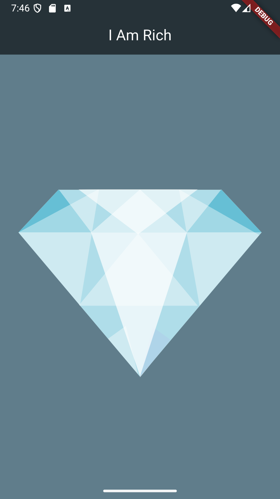

# i_am_rich

간단한 정적 Flutter 화면 예제입니다.  
커스텀 색상의 AppBar와 배경을 가진 `Scaffold` 위에, 에셋 이미지를 중앙에 배치해 보여줍니다.

## 주요 구현

- `MaterialApp` / `Scaffold` / `AppBar` 기본 레이아웃 구성
- `backgroundColor`와 AppBar 색을 직접 지정해 테마 일관성 유지
- `centerTitle: true`로 타이틀 정렬
- `Image.asset('images/diamond.png')` 으로 로컬 에셋 표시
- `Center` 위젯으로 컨텐츠 정중앙 배치

## 스크린샷

앱 실제 실행 화면:

